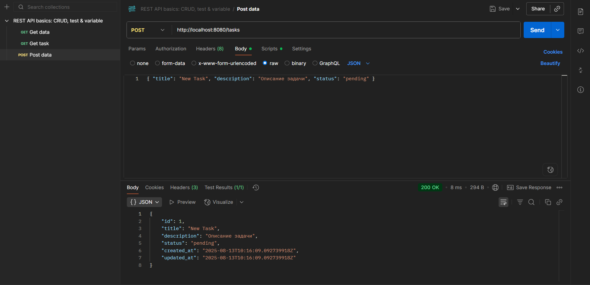
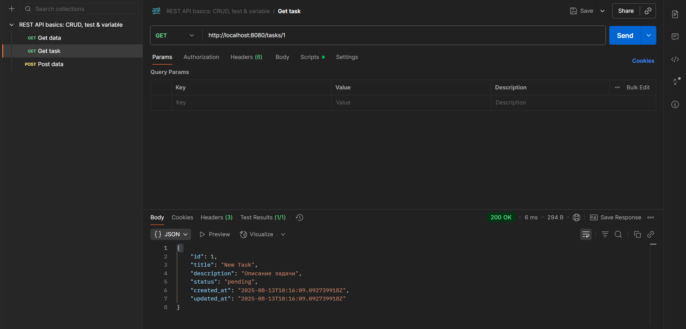
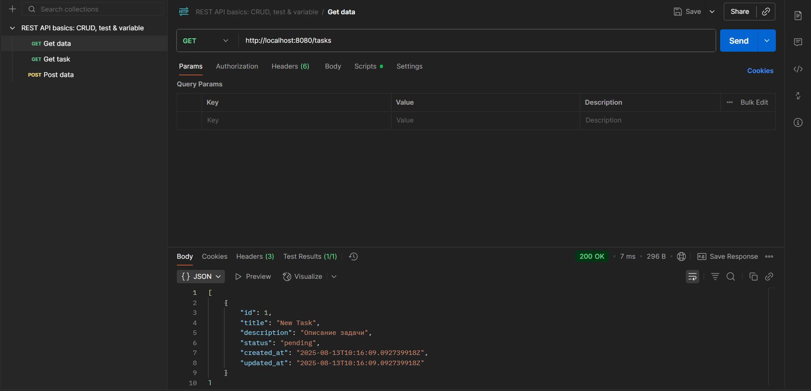
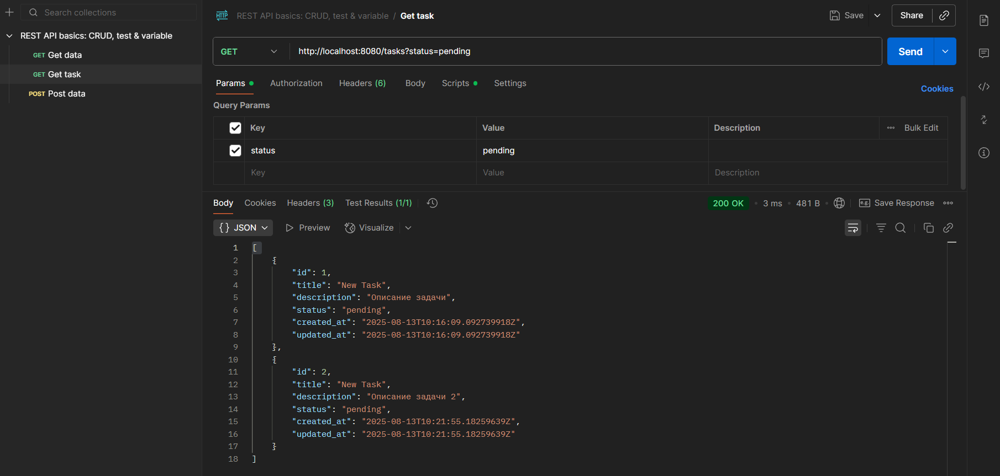
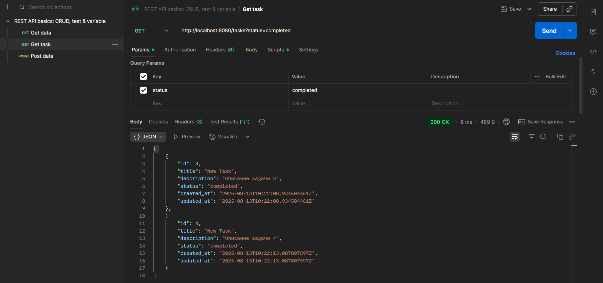

# Tasker - REST API на Go

Tasker - это простое REST API для управления задачами с использованием чистой архитектуры (entity → repository → service → transport), асинхронного логгера и Docker.

## Структура проекта

```
cmd/
    main.go                  // точка входа приложения
internal/
    entity/
        task.go              // структуры Task и Status
    logger/
        logger.go            // асинхронный логгер через канал
    repository/
        memory.go            // in-memory хранилище
        repository.go        // интерфейс репозитория и ошибки
    service/
        task.go              // бизнес-логика CRUD
    transport/
        http/
            handler.go       // HTTP обработчики
.gitignore
Dockerfile
Makefile                     // сборка, запуск, остановка контейнера, удаление контейнера и образа, просмотр логов
go.mod
LICENSE
README.md
```

## Установка и запуск

### 1. Сборка Docker образа

```
make docker_build
```

### 2. Запуск контейнера

```
make docker_run
```

Приложение будет доступно на `http://localhost:8080`

### 3. Просмотр логов

```
make docker_logs
```

### 4. Остановка контейнера

```
make docker_stop
```

### 5. Удаление контейнера и образа

Сначала удалите контейнер:

```
make docker_remove
```

Затем пользователь может удалить Docker образ вручную:

```
docker rmi tasker:latest
```

Для автоматизированного удаления образа через Makefile используйте:

```
make docker_clean
```

## API эндпоинты

### Получить список задач

```
GET /tasks
GET /tasks?status=pending
GET /tasks?status=completed
```

### Получить задачу по ID

```
GET /tasks/{id}
```

### Создать новую задачу

```
POST /tasks
Content-Type: application/json

{
    "title": "New Task",
    "description": "Описание задачи",
    "status": "pending"
}
```

### Примеры с curl

Получить все задачи:

```
curl -X GET http://localhost:8080/tasks
```

Получить задачу по ID:

```
curl -X GET http://localhost:8080/tasks/1
```

Создать новую задачу:

```
curl -X POST http://localhost:8080/tasks \
  -H 'Content-Type: application/json' \
  -d '{"title":"New Task", "description":"Описание задачи", "status":"pending"}'
```

## Логика и архитектура

* **entity**: определение структур Task и Status.
* **repository**: интерфейс TaskRepository и реализация in-memory.
* **service**: бизнес-логика для CRUD операций и логирования.
* **transport/http**: HTTP обработчики с сериализацией JSON.
* **logger**: асинхронный логгер через канал.
* **cmd/main.go**: точка входа, DI, graceful shutdown.

## Best Practices

* Чистая архитектура.
* Асинхронный логгер не блокирует основной поток.
* Валидация статусов задач.
* Graceful shutdown сервера.
* Makefile автоматизирует сборку, запуск и управление контейнером и образом.
* Используются best practices коммитов (Conventional Commits, читаемые и структурированные).

## Скриншоты и тестирование в Postman










